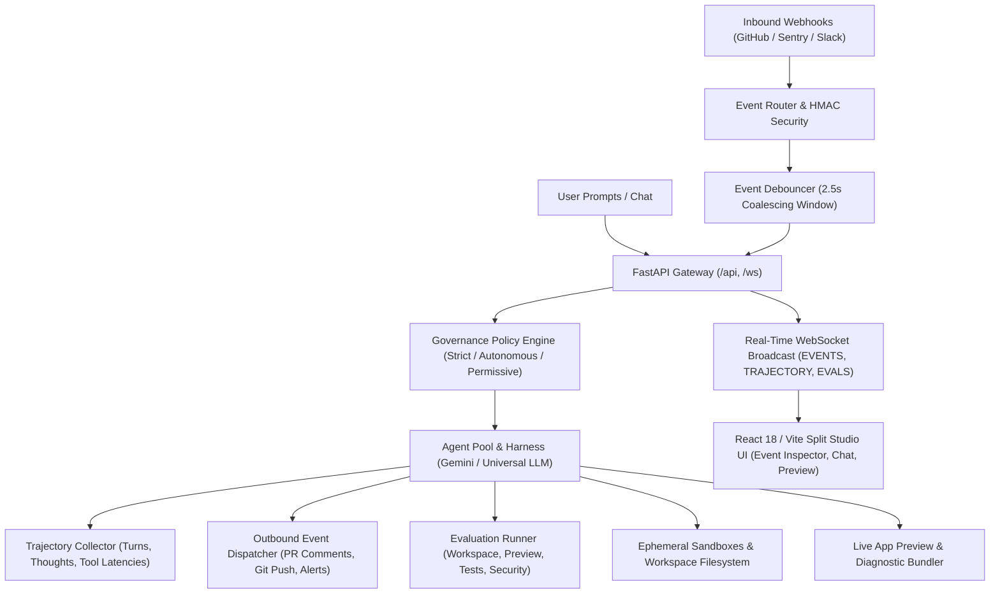

<div align="center">

#  Cyclode

**The Event-Driven & Prompt-Driven Autonomous Engineering Platform**

[](frontend/)
[](backend/)
[](backend/tests/)
[](LICENSE)

</div>

---

## Overview

**Cyclode** is a full-lifecycle **event-driven and prompt-driven autonomous engineering platform** designed to automate developer loops, interactive software prototyping, pull request triage, and continuous system maintenance. Built for modern software teams, Cyclode bridges human developer intent with autonomous background agent loops:

1. **Prompt-Driven Engineering**: Developers converse naturally with specialized autonomous agent personas (`SoftwareEngineer`, `AppBuilder`, `CodeReviewer`, `IssueResolver`, `APMTriage`) across a split studio workspace with real-time token streaming, live application previews, and first-class execution plans.
2. **Event-Driven Autonomous Awakening**: Background agents awaken automatically in response to GitHub webhooks (`check_run` CI test failures, PR comments, code pushes, issue updates), Sentry error alerts, and Slack slash commands, executing self-healing loops without human intervention.
3. **End-to-End Trajectory Auditing & Deterministic Evals**: Every turn, thought, and tool action is preserved in an immutable agent trajectory with time-travel replay and scored against rigorous deterministic evaluation gates across workspace state invariants, unit tests, preview bundles, and security jails.

<p align="center">
  
</p>

---

## Key Capabilities & Features

### 1. Event-Driven Awakening & Burst Debouncing
- **CI/CD Failure Awakening**: When a GitHub `check_run` or `status` webhook reports a test suite failure or build break, Cyclode automatically awakens or spawns a session pinned to the failing branch/PR, analyzes the error logs, writes a fix, verifies tests, and posts a commit or PR review.
- **2.5s Burst Debouncing**: Git push bursts and sequential webhook notifications are coalesced by an in-memory sliding debouncer (`EventDebouncer`), preventing agent thrashing while consolidating commit deltas into a single cohesive turn.
- **Session Key Association**: Inbound events are automatically routed to existing active branch sessions or PR contexts, preserving conversation memory and workspace worktrees.

### 2. Bi-Directional Event Stream & Live Injection Bar
- **Bi-Directional Event Timeline**: Dedicated **'Event' Tab** in the Auxiliary Pane displaying both inbound webhook triggers (`INBOUND`) with cryptographic HMAC-SHA256 verification and outbound agent dispatches (`OUTBOUND`) like PR comments, reviews, and git pushes.
- **Simulation Bar / Event Injector**: Test and verify autonomous agent loops directly from the UI with single-click injectors for CI failures, review comments, push bursts, and Sentry alerts.

### 3. Agent Trajectory Auditing & Time-Travel Replay
- **Turn-by-Turn Trajectory Inspector**: Complete end-to-end recording of internal agent reasoning thoughts, tool invocations with millisecond timing, exit codes, token consumption, and git diff snapshot SHAs.
- **Time-Travel Replay**: Instantly replay any historical agent trajectory to debug decision points and reproduction flows.

### 4. Deterministic Multi-Tier Evaluation Scorecards
- **Rigorous Verification Gates**: Decouples subjective LLM self-reporting from deterministic workspace proofs:
  - *Workspace Invariants*: Verifies modified source files exist, are non-empty, and free of syntax errors.
  - *Live Preview Bundling*: Confirms `index.html` and assets mount cleanly in the preview iframe.
  - *Unit Test Suite*: Executes automated pytest/vitest commands in the isolated worktree.
  - *Kernel Security Jail*: Enforces container containment and prevents unauthorized external tampering.
  - *Synthesis Quality*: Validates response depth, actionable diffs, and formatting standards.
- **Scorecard Progress**: Evaluated scores (0–100%) and actionable pass/fail diagnostics rendered directly in the Event Inspector and Execution Plan header.

### 5. First-Class Execution Plan Lifecycle
Prior to executing any tool commands, the agent formulates a domain-tailored step-by-step execution roadmap rendered inside a dedicated collapsible accordion positioned directly above the Reasoning and Activity streams:
- **Dynamic Archetypes**: Tailors specialized plan steps for distinct development tasks (Interactive Apps, Games, E-Commerce Catalogs, PR Reviews, Test Suites, Fullstack Scaffolding).
- **Real-Time Step Streaming**: Steps dynamically transition their state (`pending` → `in_progress` with animated spinner → `completed` / `failed`) as tools execute.
- **Vector-Only Iconography (Zero Emojis)**: Styled exclusively with pure monochrome Lucide SVG vector icons.

### 6. Split Studio Layout & Real-Estate Presets
- **Split Studio (Default - 48% Right Canvas)**: Balances compact, ergonomic chat reading measures with expansive canvas space for interactive development, live previewing, and PR inspection.
- **Preview Focus (60% Right Canvas)**: Expands the auxiliary workspace for dedicated application testing and side-by-side code reviews.
- **Wide Chat (25% Right Canvas) & Zen View (100% Canvas)**: Full customization saved persistently in `localStorage`.

### 7. Live Application Preview & Diagnostics
- **Zero-Config DOM Mounting**: Automatically detects application frameworks (Vite, React, Vue, HTML5/Tailwind), resolves asset bundles, and injects runtime telemetry.
- **Diagnostic Bundling Fallback**: Identifies missing entry points or uncompiled CSS/JS and synthesizes standalone preview runtimes with CDN headers.

### 8. Full-Fidelity Pull Request Inspector & Comment Auto-Sync
- **Live GitHub PR Discovery & Diffs**: Real-time retrieval of PR metadata, commit timelines, and syntax-highlighted unified diffs.
- **Consolidated Comments Timeline**: Unified feed aggregating PR conversations, inline code review comments, and formal review submissions.
- **Multi-Trigger Auto-Sync**: Real-time updates via WebSockets (`PR_COMMENTS_UPDATED`), focus-aware adaptive polling, and post-submission sync.

### 9. Autonomous Multi-Agent Personas
- `SoftwareEngineer`: Autonomous full-cycle software engineering, feature implementation, refactoring, and test verification.
- `AppBuilder`: Interactive web application scaffolding, live preview verification, and design craftsmanship.
- `CodeReviewer`: Deep PR diff analysis, security audits, null safety checks, and edge-case validation.
- `IssueResolver`: Targeted root-cause investigation, reproduction script authoring, and automated patching.
- `APMTriage`: Production crash triage, stack trace analysis, and synthetic regression reproducing.

---

## Architecture



---

## Quick Start

### One-Command Launch with `./run.sh` (Recommended)

Cyclode provides an automated startup script that verifies prerequisites, provisions environment configurations, launches container services, polls health endpoints, and streams live logs:

```bash
# 1. Clone repository
git clone git@github.com:rubum/cyclode.git
cd cyclode

# 2. Configure API keys (e.g., GEMINI_API_KEY, GITHUB_TOKEN)
cp .env.example .env
nano .env

# 3. Launch Cyclode workstation
chmod +x run.sh
./run.sh
```

The `./run.sh` script automatically:
1. **Prerequisite Check**: Validates that Docker runtime is installed and active.
2. **Environment & Volume Setup**: Ensures `.env` is initialized and creates `workspaces/` and `data/` local mounts.
3. **Build & Launch**: Runs `docker compose up --build -d` in detached mode.
4. **Active Health Polling**: Actively polls the backend API (`http://localhost:8000/healthz`) and frontend workstation (`http://localhost:5174`) until ready.
5. **Live Log Stream**: Displays ready status with connection links and automatically tails container logs.

---

### Manual Docker Compose Launch

Alternatively, you can launch directly using Docker Compose:

```bash
docker compose up --build
```

- **Frontend Workstation**: [http://localhost:5174](http://localhost:5174) (or [http://localhost:5173](http://localhost:5173))
- **Backend API & Swagger Docs**: [http://localhost:8000/docs](http://localhost:8000/docs)
- **WebSocket Streaming**: `ws://localhost:8000/ws`

---

## Local Development (Without Docker)

### Backend

```bash
cd backend
python -m venv .venv
source .venv/bin/activate
pip install -r requirements.txt
uvicorn app.main:app --host 0.0.0.0 --port 8000 --reload
```

### Frontend

```bash
cd frontend
npm install
npm run dev
```

---

## Running Tests

### Backend Test Suite (Pytest)

```bash
# In Docker
docker exec -e PYTHONPATH=. cyclode-backend pytest -v

# Locally
cd backend
PYTHONPATH=. pytest -v
```

### Frontend Typecheck & Build

```bash
# In Docker
docker exec cyclode-frontend npm run build

# Locally
cd frontend
npm run build
```

---

## Repository Structure

```
cyclode/
├── assets/                    # Brand logos and vector graphics
│   ├── logo.svg               # Pure transparent epicycloid vector logo
│   └── logo.png               # High-resolution raster brand mark
├── backend/
│   ├── app/
│   │   ├── agent/             # Agent pool, harness, dynamic planning, and personas
│   │   ├── api/               # FastAPI REST endpoints, WebSockets, preview, and tasks
│   │   ├── core/              # Event router, worktrees, policies, and sandboxes
│   │   ├── db/                # SQLAlchemy async models, migrations, and session
│   │   └── integrations/      # GitHub, Slack, AppSignal, and Vault Interceptor
│   └── tests/                 # Comprehensive pytest test suite (92 passing)
├── frontend/
│   ├── public/                # Favicon suite (SVG, ICO, 16px, 32px, 180px, 512px)
│   ├── src/
│   │   ├── components/        # Chat, ExecutionPlan, AuxiliaryPane, Layout, Header, Sidebar
│   │   ├── contexts/          # WebSocket streaming and application state
│   │   └── types/             # TypeScript type definitions and LayoutPresets
│   └── package.json
├── docker-compose.yml         # Container orchestration
├── Dockerfile                 # Unified container specification
├── run.sh                     # Automated workstation launch & healthcheck script
├── .env.example               # Configuration template
└── README.md
```

---

## License

Proprietary / Internal — Cyclode
