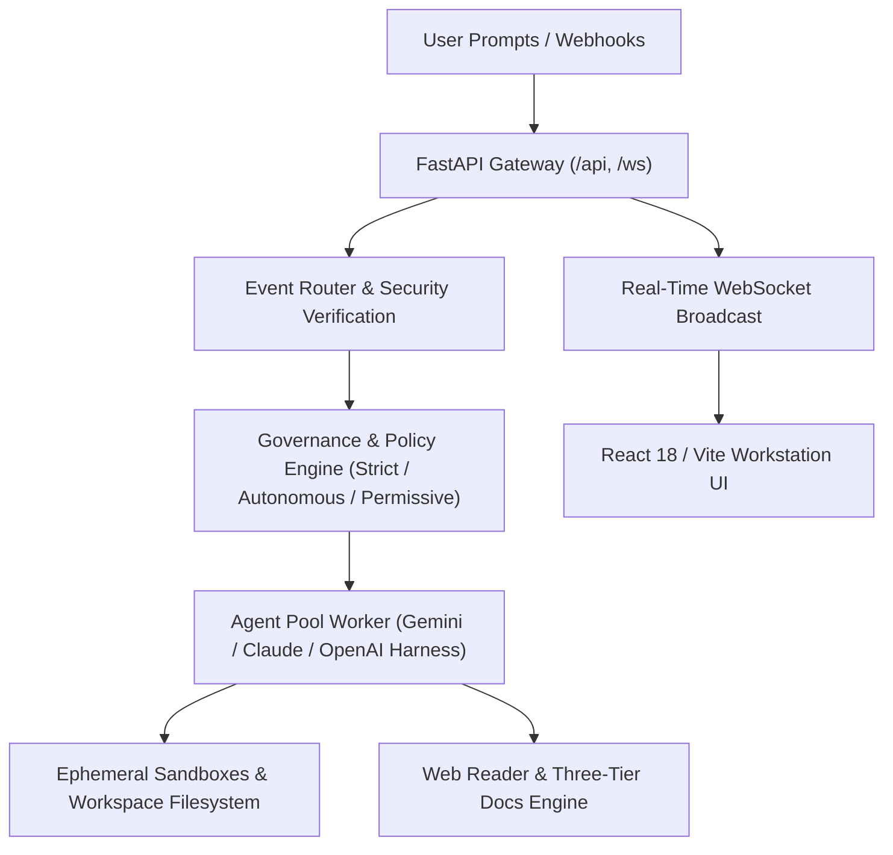

<div align="center">

#  Cyclode

**Autonomous AI Engineering Workstation & Multi-Agent Orchestration Platform**

[](frontend/)
[](backend/)
[](backend/tests/)
[](LICENSE)

</div>

---

## Overview

**Cyclode** is an autonomous AI engineering workstation designed for full-lifecycle software engineering, automated PR reviews, incident triage, and interactive pair programming. Built for high-leverage software teams, Cyclode pairs developer intent with autonomous background agents executing inside isolated, disposable sandboxes with real-time token streaming, human-in-the-loop governance policies, and an integrated documentation research engine.

---

## Key Features

### 1. Interactive Three-Tier Documentation Browser
Embedded directly into the workstation's Auxiliary Pane, allowing developers and agents to research libraries side-by-side with code:
- **History Navigation Stack**: Dedicated `<` Back and `>` Forward buttons maintaining a full per-session browsing stack.
- **On-Page Table of Contents Outline**: Dynamic dropdown popover extracting document headings (`h1`–`h4`) with in-page smooth scrolling.
- **Recursive Site Tree Drawer**: Collapsible 220px navigation drawer that automatically parses and rebases documentation hierarchies from **Docusaurus**, **Astro Starlight**, **MkDocs**, and **GitBook**, complete with real-time topic search filtering.

### 2. Side-by-Side Web Reader & GitHub Inspector
- **Clean Markdown Extraction**: Fetches external documentation, isolates core content (`<article>`, `<main>`), and converts it into high-fidelity markdown stripped of clutter, cookie banners, and noise.
- **Automated GitHub Inspector**: Directly detects GitHub repository links and displays live repository statistics (stars, language, license, forks, clone URL) alongside formatted README documentation.
- **Session-Scoped Isolation**: Documentation previews are strictly isolated per session, preventing cross-session tab pollution.

### 3. AI Session Titles & Inline Renaming
- **Dual-Phase Title Generation**: Immediate heuristic cleanup on prompt submission followed by background asynchronous AI title synthesis (Gemini Flash).
- **Inline Editing**: Double-click session titles in the Sidebar or click the edit pencil in the Chat header to rename sessions on the fly, synchronized via WebSockets (`TASK_TITLE_UPDATED`).

### 4. Autonomous Multi-Agent Personas
- `PairProgrammer`: General architecture design, full-stack implementation, refactoring, and test verification.
- `CodeReviewer`: Deep PR diff analysis, security audits, null safety checks, and edge-case validation.
- `IssueResolver`: Targeted root-cause investigation, reproduction script authoring, and automated patching.
- `APMTriage`: Production crash triage, stack trace analysis, and synthetic regression reproducing.

### 5. Webhook Simulator & Event Router
- Built-in simulation environment to trigger and test inbound webhooks from **GitHub**, **Slack**, **AppSignal**, or custom systems.
- Cryptographic signature verification supporting HMAC-SHA256 (GitHub / Slack) and Bearer tokens.
- Automated event routing to standing automation rules or agent dispatch.

### 6. Granular Governance & Approval Policies
- Three distinct governance security tiers: `STRICT`, `AUTONOMOUS`, and `PERMISSIVE`.
- Automated action gating requiring explicit human approval (`AWAITING_APPROVAL`) for destructive actions, shell executions, git push, and notifications.

### 7. Isolated Ephemeral Sandboxes
- Every task runs in an isolated workspace with safe execution sandboxing.
- Interactive **Sandbox Inspector** provides live filesystem tree views, disk consumption analytics, and git commit history tracking.

### 8. One Dark Pro Workstation Interface
- Designed with 100% viewport space utilization for dense engineering productivity.
- Flexible workspace layout presets: `Standard`, `Wide`, and `Zen ⛶` (fullscreen).

---

## Architecture



---

## Quick Start

### One-Command Launch with `./run.sh` (Recommended)

Cyclode provides an automated startup script that verifies prerequisites, provisions environment configurations, launches container services, polls health endpoints, and streams live logs:

```bash
# 1. Clone repository
git clone git@github.com:rubum/adappty.git cyclode
cd cyclode

# 2. Configure API keys (e.g., GEMINI_API_KEY, GITHUB_TOKEN)
cp .env.example .env
nano .env

# 3. Launch Cyclode workstation
chmod +x run.sh
./run.sh
```

The `./run.sh` script automatically:
1. **Prerequisite Check**: Validates that Docker runtime is installed and active.
2. **Environment & Volume Setup**: Ensures `.env` is initialized and creates `workspaces/` and `data/` local mounts.
3. **Build & Launch**: Runs `docker compose up --build -d` in detached mode.
4. **Active Health Polling**: Actively polls the backend API (`http://localhost:8000/healthz`) and frontend workstation (`http://localhost:5174`) until ready.
5. **Live Log Stream**: Displays ready status with connection links and automatically tails container logs.

---

### Manual Docker Compose Launch

Alternatively, you can launch directly using Docker Compose:

```bash
docker compose up --build
```

- **Frontend Workstation**: [http://localhost:5174](http://localhost:5174) (or [http://localhost:5173](http://localhost:5173))
- **Backend API & Swagger Docs**: [http://localhost:8000/docs](http://localhost:8000/docs)
- **WebSocket Streaming**: `ws://localhost:8000/ws`

---

## Local Development (Without Docker)

### Backend

```bash
cd backend
python -m venv .venv
source .venv/bin/activate
pip install -r requirements.txt
uvicorn app.main:app --host 0.0.0.0 --port 8000 --reload
```

### Frontend

```bash
cd frontend
npm install
npm run dev
```

---

## Running Tests

### Backend Test Suite (Pytest)

```bash
# In Docker
docker exec -e PYTHONPATH=. adappty-backend pytest -v

# Locally
cd backend
PYTHONPATH=. pytest -v
```

### Frontend Typecheck & Build

```bash
# In Docker
docker exec adappty-frontend npx tsc --noEmit
docker exec adappty-frontend npm run build

# Locally
cd frontend
npx tsc --noEmit
npm run build
```

---

## Repository Structure

```
cyclode/
├── assets/                    # Brand logos and vector graphics
│   ├── logo.svg               # Pure transparent epicycloid vector logo
│   └── logo.png               # High-resolution raster brand mark
├── backend/
│   ├── app/
│   │   ├── agent/             # Agent pool, model harnesses, and title generator
│   │   ├── api/               # FastAPI REST endpoints, WebSockets, and web reader
│   │   ├── core/              # Event router, security verification, and sandboxes
│   │   ├── models/            # Database and Pydantic schemas
│   │   └── services/          # Integrations (GitHub, Slack, AppSignal)
│   └── tests/                 # Comprehensive pytest test suite (38 passing)
├── frontend/
│   ├── public/                # Favicon suite (SVG, ICO, 16px, 32px, 180px, 512px)
│   ├── src/
│   │   ├── components/        # Workstation UI: Chat, AuxiliaryPane, DocsViewer, Sidebar, Header
│   │   ├── contexts/          # WebSocket streaming and application state
│   │   └── types/             # TypeScript type definitions
│   └── package.json
├── docker-compose.yml         # Container orchestration
├── Dockerfile                 # Unified container specification
├── run.sh                     # Automated workstation launch & healthcheck script
├── .env.example               # Configuration template
└── README.md
```

---

## License

Proprietary / Internal — Cyclode
