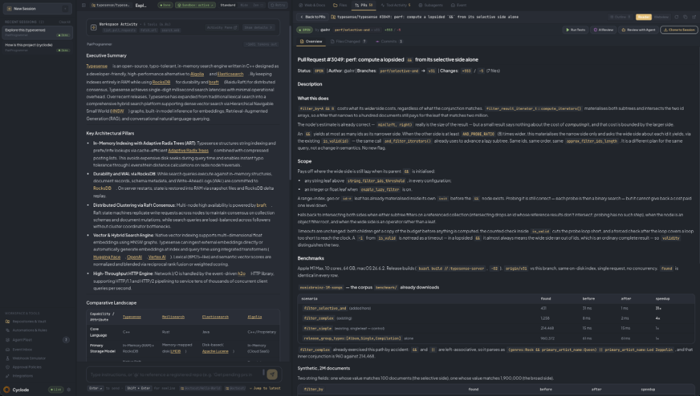
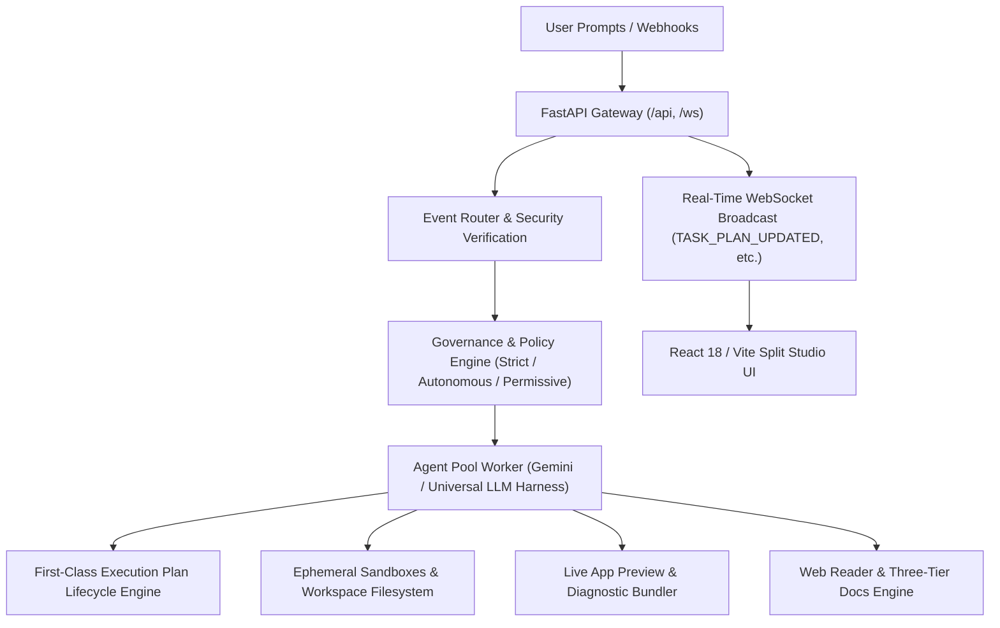

<div align="center">

#  Cyclode

**Autonomous AI Engineering Workstation & Multi-Agent Orchestration Platform**

[](frontend/)
[](backend/)
[](backend/tests/)
[](LICENSE)

</div>

---

## Overview

**Cyclode** is an autonomous AI engineering workstation designed for full-lifecycle software development, interactive application prototyping, automated PR reviews, incident triage, and pair programming. Built for high-leverage engineering teams, Cyclode pairs developer intent with autonomous background agents executing inside isolated, disposable sandboxes with real-time token streaming, human-in-the-loop governance policies, first-class execution plan lifecycle tracking, and an integrated live preview engine.

<p align="center">
  
</p>

---

## Key Capabilities & Features

### 1. First-Class Execution Plan Lifecycle
Prior to executing any tool commands, the agent formulates a domain-tailored step-by-step execution roadmap rendered inside a dedicated collapsible accordion positioned directly above the Reasoning and Activity streams:
- **Context-Aware Dynamic Archetypes**: Tailors specialized plan steps for distinct development tasks:
  - *Messaging Applications*: Channels, reactive chat stream, state store, and live DOM interaction.
  - *Interactive Games*: Viewport canvas, player controls, collision mechanics, and 60fps render loops.
  - *Calculators & Data Tools*: Keypad controls, calculation engine, memory history, and arithmetic precision.
  - *E-Commerce Catalogs*: Product grid, filter drawers, cart state store, and mock checkout flows.
  - *PR Reviews, Test Suites, Web Research, and Fullstack Scaffolding*.
- **Real-Time Step Streaming**: Steps dynamically transition their state (`pending` → `in_progress` with animated spinner → `completed` / `failed`) as tools execute.
- **Strict Post-Turn Evaluation Gate**: The agent audits workspace telemetry upon completion. A plan is **never** falsely marked `Accomplished` if live preview verification fails, if API quota is exhausted, or if no tools were executed. If defects are found, the evaluation explicitly transitions to `Revision Required` (`needs_revision`) detailing the exact failing checks.
- **Vector-Only Iconography (Zero Emojis)**: Styled exclusively with pure monochrome Lucide SVG vector icons (`ListOrdered`, `CheckCircle2`, `Loader2`, `Circle`, `AlertCircle`).

### 2. Split Studio Layout & Real-Estate Presets
Optimized workspace geometry balancing compact, ergonomic chat reading measures with expansive canvas space for interactive development:
- **Split Studio (New Default - 48% Right Canvas)**: Allocates 48% of the viewport to the right auxiliary pane (Live Previews, PR Diffs, File Trees, Runtime Logs) while keeping the chat canvas at an ergonomic `max-w-3xl` reading measure.
- **Preview Focus (60% Right Canvas)**: Automatically collapses the navigation sidebar and expands the auxiliary workspace to 60% for dedicated application testing and side-by-side code reviews.
- **Wide Chat (25% Right Canvas)**: Expands the center chat canvas to 75% for reading voluminous logs and comprehensive technical briefings.
- **Zen View (100% Full Canvas)**: Distraction-free full-width chat canvas.
- **Persistent Geometry**: Custom drag-resized percentages and chosen layout presets are automatically preserved in `localStorage` across reloads and tab navigations.

### 3. Live Application Preview & Diagnostics
- **Zero-Config DOM Mounting**: Automatically detects application frameworks (Vite, React, Vue, HTML5/Tailwind), resolves asset bundles, and injects runtime telemetry.
- **Diagnostic Bundling Fallback**: Identifies missing entry points or uncompiled CSS/JS and synthesizes standalone preview runtimes with CDN headers and interactive component mounts.
- **Build Circuit Breaker**: Detects repeated compilation/bundling errors and guides the agent out of conflicting configuration edits.

### 4. Full-Fidelity Pull Request Inspector & Comment Auto-Sync
- **Live GitHub PR Discovery & Diffs**: Real-time retrieval of PR metadata, commit timelines, and syntax-highlighted unified diffs for both public and vaulted private repositories.
- **Consolidated Comments Timeline**: Unified feed aggregating PR conversations, inline code review comments, and formal review submissions (`Approved`, `Changes Requested`).
- **Multi-Trigger Auto-Sync**: Real-time updates via WebSockets (`PR_COMMENTS_UPDATED`), focus-aware adaptive polling (every 20s when visible), post-submission sync, and on-demand refresh.
- **Code Context Anchors & In-App Composer**: Inspect diff hunks directly on review comments, jump to code lines with one click, and submit replies or comments directly to GitHub.
- **Sandbox Test Execution & AI Review Reports**: Run automated tests in isolated worktrees and generate deep architectural & security code reviews.

### 5. In-Place Activity Stream & Real-Time Telemetry
- **Single-Source Execution Stream**: Tools transition smoothly in-place from active execution (`running...` with spinner) to completed rows (`Ran $ command` with duration and exit code) without duplicate floating action pills.
- **Live Token & Stream Monitoring**: Real-time streaming of model reasoning thoughts, message tokens, and tool invocations over WebSockets.

### 6. Interactive Three-Tier Documentation Browser
Embedded directly into the workstation's Auxiliary Pane, allowing developers and agents to research libraries side-by-side with code:
- **History Navigation Stack**: Dedicated `<` Back and `>` Forward buttons maintaining a full per-session browsing stack.
- **On-Page Table of Contents Outline**: Dynamic dropdown popover extracting document headings (`h1`–`h4`) with in-page smooth scrolling.
- **Recursive Site Tree Drawer**: Collapsible 220px navigation drawer that automatically parses and rebases documentation hierarchies from **Docusaurus**, **Astro Starlight**, **MkDocs**, and **GitBook**, complete with real-time topic search filtering.

### 7. Transparent API Quota & Fail-Safe Telemetry
- Direct, high-visibility surfacing of Google Gemini API Quota exhaustion notices (HTTP 429) with clickable links to [Google AI Studio](https://ai.studio/projects) and inline key switching, preventing deceptive fallback responses.

### 8. Webhook Simulator & Event Router
- Built-in simulation environment to trigger and test inbound webhooks from **GitHub**, **Slack**, **AppSignal**, or custom systems.
- Cryptographic signature verification supporting HMAC-SHA256 (GitHub / Slack) and Bearer tokens.
- Automated event routing to standing automation rules or agent dispatch.

### 9. Granular Governance & Approval Policies
- Three distinct governance security tiers: `STRICT`, `AUTONOMOUS`, and `PERMISSIVE`.
- Automated action gating requiring explicit human approval (`AWAITING_APPROVAL`) for destructive actions, shell executions, git push, and notifications.

### 10. Autonomous Multi-Agent Personas
- `PairProgrammer`: General architecture design, fullstack implementation, refactoring, and test verification.
- `AppBuilder`: Interactive web application scaffolding, live preview verification, and design craftsmanship.
- `CodeReviewer`: Deep PR diff analysis, security audits, null safety checks, and edge-case validation.
- `IssueResolver`: Targeted root-cause investigation, reproduction script authoring, and automated patching.
- `APMTriage`: Production crash triage, stack trace analysis, and synthetic regression reproducing.

---

## Architecture



---

## Quick Start

### One-Command Launch with `./run.sh` (Recommended)

Cyclode provides an automated startup script that verifies prerequisites, provisions environment configurations, launches container services, polls health endpoints, and streams live logs:

```bash
# 1. Clone repository
git clone git@github.com:rubum/cyclode.git
cd cyclode

# 2. Configure API keys (e.g., GEMINI_API_KEY, GITHUB_TOKEN)
cp .env.example .env
nano .env

# 3. Launch Cyclode workstation
chmod +x run.sh
./run.sh
```

The `./run.sh` script automatically:
1. **Prerequisite Check**: Validates that Docker runtime is installed and active.
2. **Environment & Volume Setup**: Ensures `.env` is initialized and creates `workspaces/` and `data/` local mounts.
3. **Build & Launch**: Runs `docker compose up --build -d` in detached mode.
4. **Active Health Polling**: Actively polls the backend API (`http://localhost:8000/healthz`) and frontend workstation (`http://localhost:5174`) until ready.
5. **Live Log Stream**: Displays ready status with connection links and automatically tails container logs.

---

### Manual Docker Compose Launch

Alternatively, you can launch directly using Docker Compose:

```bash
docker compose up --build
```

- **Frontend Workstation**: [http://localhost:5174](http://localhost:5174) (or [http://localhost:5173](http://localhost:5173))
- **Backend API & Swagger Docs**: [http://localhost:8000/docs](http://localhost:8000/docs)
- **WebSocket Streaming**: `ws://localhost:8000/ws`

---

## Local Development (Without Docker)

### Backend

```bash
cd backend
python -m venv .venv
source .venv/bin/activate
pip install -r requirements.txt
uvicorn app.main:app --host 0.0.0.0 --port 8000 --reload
```

### Frontend

```bash
cd frontend
npm install
npm run dev
```

---

## Running Tests

### Backend Test Suite (Pytest)

```bash
# In Docker
docker exec -e PYTHONPATH=. cyclode-backend pytest -v

# Locally
cd backend
PYTHONPATH=. pytest -v
```

### Frontend Typecheck & Build

```bash
# In Docker
docker exec cyclode-frontend npm run build

# Locally
cd frontend
npm run build
```

---

## Repository Structure

```
cyclode/
├── assets/                    # Brand logos and vector graphics
│   ├── logo.svg               # Pure transparent epicycloid vector logo
│   └── logo.png               # High-resolution raster brand mark
├── backend/
│   ├── app/
│   │   ├── agent/             # Agent pool, harness, dynamic planning, and personas
│   │   ├── api/               # FastAPI REST endpoints, WebSockets, preview, and tasks
│   │   ├── core/              # Event router, worktrees, policies, and sandboxes
│   │   ├── db/                # SQLAlchemy async models, migrations, and session
│   │   └── integrations/      # GitHub, Slack, AppSignal, and Vault Interceptor
│   └── tests/                 # Comprehensive pytest test suite (90 passing)
├── frontend/
│   ├── public/                # Favicon suite (SVG, ICO, 16px, 32px, 180px, 512px)
│   ├── src/
│   │   ├── components/        # Chat, ExecutionPlan, AuxiliaryPane, Layout, Header, Sidebar
│   │   ├── contexts/          # WebSocket streaming and application state
│   │   └── types/             # TypeScript type definitions and LayoutPresets
│   └── package.json
├── docker-compose.yml         # Container orchestration
├── Dockerfile                 # Unified container specification
├── run.sh                     # Automated workstation launch & healthcheck script
├── .env.example               # Configuration template
└── README.md
```

---

## License

Proprietary / Internal — Cyclode
