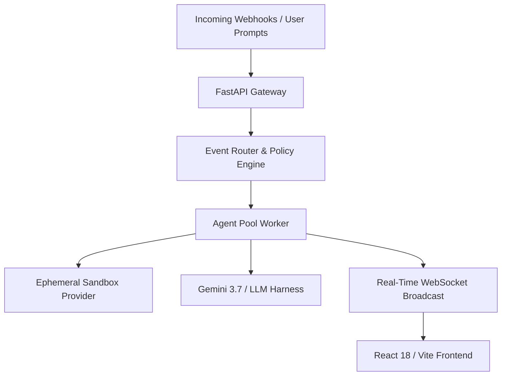

# Adappty ⚡

> **Event-Driven Autonomous Multi-Agent Orchestrator & Workstation**

Adappty is an autonomous AI agent orchestration platform designed to handle software engineering workflows, automated PR code reviews, production incident triage, and interactive pair programming in isolated, disposable ephemeral sandboxes.

---

## 🌟 Key Features

- **⚡ Event-Driven Workflow Automations**:
  - Ingest webhooks from GitHub, Sentry, AppSignal, and Slack.
  - Trigger standing automation rules to automatically review PRs, triage errors, or dispatch background agents.
- **🛡️ Isolated Ephemeral Sandboxes**:
  - Every session runs in an isolated workspace with safe execution sandboxing.
  - Interactive **Sandbox Inspector** providing full filesystem tree views, commit hashes, and disk analytics.
- **🤖 Autonomous Multi-Agent Personas**:
  - `PairProgrammer`: General architecture, debugging, refactoring, and test verification.
  - `CodeReviewer`: Deep PR diff analysis, null safety, and edge-case validation.
  - `IssueResolver`: Targeted root-cause investigation and automated patching.
  - `APMTriage`: Fast crash triage and synthetic regression reproducing.
- **💬 Real-Time Streaming Workstation**:
  - WebSocket streaming for agent thoughts, tool logs, diffs, and live output tokens.
  - One Dark Pro themed UI with 100% viewport space utilization and customizable layout presets (`Standard`, `Wide`, `Zen ⛶`).
- **🔒 Granular Governance & Approval Policies**:
  - Configurable safety policies for git push, PR creation, shell executions, and notifications.
  - Built-in `AWAITING_APPROVAL` human-in-the-loop workflows.
- **🔑 Proactive Credential Assistance**:
  - Handles private repository access roadblocks interactively without dummy mock code fallbacks.

---

## 🏗️ Architecture



---

## 🚀 Quick Start with Docker

### 1. Clone & Configure Environment

```bash
git clone git@github.com:rubum/adappty.git
cd adappty
cp .env.example .env
```

Edit `.env` to configure your API keys (e.g., `GEMINI_API_KEY`, `GITHUB_TOKEN`).

### 2. Start Application

```bash
docker-compose up --build
```

- **Frontend**: [http://localhost:5174](http://localhost:5174) (or [http://localhost:5173](http://localhost:5173))
- **Backend API & Swagger**: [http://localhost:8000/docs](http://localhost:8000/docs)
- **WebSocket Endpoint**: `ws://localhost:8000/ws`

---

## 🛠️ Local Development (Without Docker)

### Backend

```bash
cd backend
python -m venv .venv
source .venv/bin/activate
pip install -r requirements.txt
uvicorn app.main:app --host 0.0.0.0 --port 8000 --reload
```

### Frontend

```bash
cd frontend
npm install
npm run dev
```

---

## 🧪 Running Tests

### Backend Unit & Integration Tests

```bash
# In Docker
docker exec adappty-backend python -m pytest -v

# Locally
cd backend
pytest -v
```

### Frontend Typecheck & Build

```bash
# In Docker
docker exec adappty-frontend npm run build

# Locally
cd frontend
npm run build
```

---

## 📁 Repository Structure

```
adappty/
├── backend/
│   ├── app/
│   │   ├── agent/             # Agent pool and persona execution loop
│   │   ├── api/               # FastAPI REST & WebSocket endpoints
│   │   ├── core/              # Config, security, and sandboxes
│   │   ├── models/            # Database and Pydantic schemas
│   │   └── services/          # Integrations (GitHub, Slack, AppSignal)
│   └── tests/                 # Pytest test suite
├── frontend/
│   ├── src/
│   │   ├── components/        # Chat, Sidebar, Panes, Sandbox Modal, Fleet
│   │   ├── contexts/          # WebSocket context
│   │   └── types/             # TypeScript definitions
│   └── package.json
├── docker-compose.yml         # Container orchestrator
├── Dockerfile                 # Unified container definition
├── .env.example               # Example configuration
└── README.md
```

---

## 📄 License

Proprietary / Internal - Adappty
