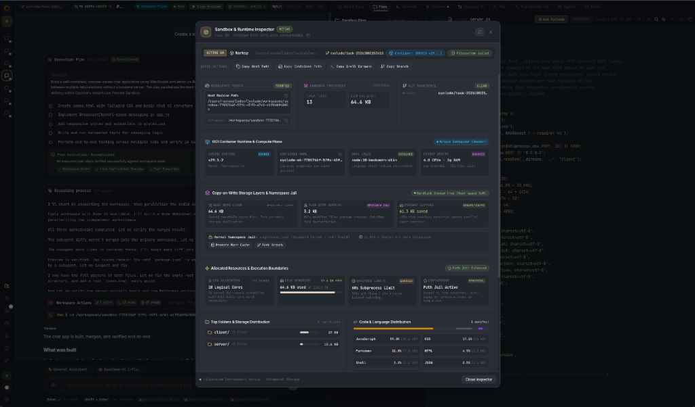
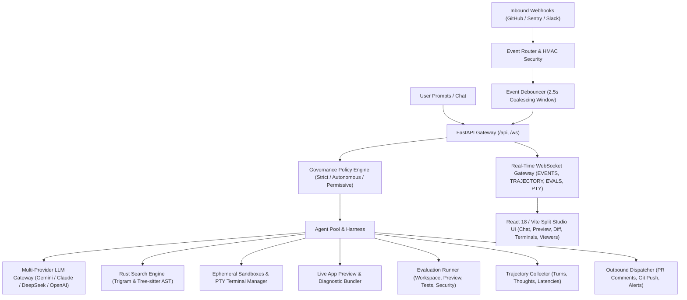

<div align="center">

<h1 align="center" style="display: flex; align-items: center; justify-content: center; gap: 12px; font-size: 2.2rem; font-weight: 700; margin-bottom: 8px;">
  
  <span>Cyclode</span>
</h1>

<p align="center">
  <strong>The Event-Driven &amp; Prompt-Driven Autonomous Engineering Platform</strong>
</p>

<p align="center">
  <a href="https://pypi.org/project/cyclode-ai/"></a>
  <a href="frontend/"></a>
  <a href="backend/"></a>
  <a href="backend/tests/"></a>
  <a href="crates/cyclode-search/"></a>
  <a href="LICENSE"></a>
</p>

</div>

---

## Overview

**Cyclode** is a full-lifecycle **event-driven and prompt-driven autonomous engineering platform** designed to automate developer workflows, interactive software prototyping, pull request triage, and continuous system maintenance. Built for modern software engineering teams, Cyclode seamlessly bridges human developer intent with autonomous background agent loops:

1. **Prompt-Driven Engineering**: Converse naturally with specialized autonomous agent personas (`SoftwareEngineer`, `AppBuilder`, `CodeReviewer`, `IssueResolver`, `APMTriage`) across a split studio workspace with real-time token streaming, live application previews, persistent PTY terminals, and first-class execution plans.
2. **Event-Driven Autonomous Awakening**: Background agents awaken automatically in response to GitHub webhooks (`check_run` CI test failures, PR reviews, code pushes, issue updates), Sentry error alerts, and Slack commands, executing self-healing loops without human intervention.
3. **End-to-End Trajectory Auditing & Deterministic Evals**: Every turn, thought, and tool action is preserved in an immutable agent trajectory with time-travel replay and scored against rigorous deterministic evaluation gates across workspace state invariants, unit tests, preview bundles, and security jails.

<p align="center">
  
</p>

---

## Key Capabilities & Features

### 1. Event-Driven Awakening & Burst Debouncing
- **CI/CD Failure Awakening**: When a GitHub `check_run` or `status` webhook reports a test suite failure or build break, Cyclode automatically awakens or spawns a session pinned to the failing branch/PR, analyzes error logs, writes a fix, verifies tests, and posts a commit or PR review.
- **2.5s Burst Debouncing**: Rapid git push bursts and sequential webhook notifications are coalesced by an in-memory sliding debouncer (`EventDebouncer`), preventing agent thrashing while consolidating commit deltas into a single cohesive turn.
- **Session Key Association**: Inbound events are automatically routed to existing active branch sessions or PR contexts, preserving conversation memory and workspace worktrees.

### 2. High-Performance Rust Search & Tree-sitter Code Intelligence
- **Native Trigram Indexing**: Powered by [`crates/cyclode-search`](crates/cyclode-search/), providing sub-millisecond full-text and trigram code search across large repositories.
- **Tree-sitter AST Parsing**: Native language grammar support (Python, Rust, Go) for accurate symbol extraction, definition lookups, and hierarchical code navigation.
- **PyO3 C-ABI Bindings & Standalone Daemon**: Operates either as an embedded Python extension module or as a standalone background daemon (`cyclode-searchd`).

### 3. Interactive Multi-Terminal Studio
- **Persistent PTY Multiplexer**: Spawns isolated, stateful pseudoterminal sessions managed by [`TerminalManager`](backend/app/core/sandboxes/terminal_manager.py) in the sandbox container.
- **Xterm.js Integration**: Full ANSI color escape support, resize auto-fit, and clickable web links via `@xterm/xterm` in the Auxiliary Pane.
- **Multi-Tab Session Switching**: Seamlessly toggle between multiple concurrent shell sessions directly alongside the agent conversation.

### 4. Rich Document, Jupyter Notebook & Data Viewers
- **Jupyter Notebook Studio (`.ipynb`)**: Full interactive notebook renderer with KaTeX mathematical formulas, output cell inspection, and live cell execution via [`/api/notebooks`](backend/app/api/notebooks.py).
- **Dark-Mode Word Document Viewer (`.docx`)**: Native Word document parsing and styling tailored for dark developer themes.
- **Data Tables & Archives**: Interactive CSV, TSV, JSON, and archive (`.zip`, `.tar.gz`) inspectors with search, sorting, and tree browsing.
- **Async Git Blame & Line Context**: Interactive inline blame hover cards with commit SHAs, author metadata, and relative timestamps.

### 5. Decision-Aware PR Review Lifecycle & Composer
- **Review Staging Approval Card**: Differentiates author versus reviewer workflows with contextual drafting, automated sanity checks, and staged approval/rejection actions.
- **Enhanced Comment Composer**: Markdown toolbar with bold, italic, code blocks, quote formatting, Write/Preview tab toggling, and predefined review templates.
- **Official Documentation Grounding**: Validates proposed code fixes against official external language and framework documentation prior to submitting suggestions.
- **Interactive Collapsibility & Bot Diagnostics**: Thread folding, resolved status badges, and automated bot diagnostic triage trays.

### 6. First-Class Execution Plan Lifecycle
- **Dynamic Archetypes**: Formulates structured, domain-tailored roadmaps for interactive apps, fullstack scaffolding, bug triage, test suites, and refactoring tasks.
- **Real-Time Step Streaming**: Steps dynamically transition their state (`pending` → `in_progress` with animated vector indicator → `completed` / `failed`) as tools execute.
- **Vector-Only Iconography**: Pure monochrome SVG vector graphics with zero emoji clutter.

### 7. Deterministic Multi-Tier Evaluation Scorecards
- **Rigorous Verification Gates**: Decouples subjective LLM self-reporting from deterministic workspace proofs:
  - *Workspace Invariants*: Verifies modified source files exist, are non-empty, and free of syntax errors.
  - *Live Preview Bundling*: Confirms `index.html` and assets mount cleanly in the preview iframe.
  - *Unit Test Suite*: Executes automated pytest/vitest commands in the isolated worktree.
  - *Kernel Security Jail*: Enforces container containment and prevents unauthorized external tampering.
  - *Synthesis Quality*: Validates response depth, actionable diffs, and formatting standards.
- **Scorecard Progress**: Evaluated scores (0–100%) and actionable pass/fail diagnostics rendered directly in the Event Inspector and Execution Plan header.

### 8. Multi-Provider LLM Engine & Dynamic Model Catalog
- **Multi-Model Support**: First-class provider implementations for **Google Gemini** (Gemini 3.7 / 2.5), **Anthropic Claude** (Claude 3.7 / 3.5 Sonnet), **DeepSeek** (DeepSeek V3 / R1), and **OpenAI** (GPT-4o, o1, o3-mini, and compatible custom endpoints).
- **Dynamic Routing & Catalog**: Real-time capability discovery and model selection via [`/api/models`](backend/app/api/models.py).

### 9. Split Studio Layout & Real-Estate Presets
- **Split Studio (Default - 48% Right Canvas)**: Ergonomic chat reading width balanced with expansive canvas space for live previewing and code diffs.
- **Preview Focus (60% Right Canvas)**: Expanded auxiliary workspace for deep application testing and side-by-side code reviews.
- **Wide Chat (25% Right Canvas) & Zen View (100% Canvas)**: Full customization saved persistently in `localStorage`.

### 10. Autonomous Multi-Agent Personas
- `SoftwareEngineer`: Autonomous full-cycle software engineering, feature implementation, refactoring, and test verification.
- `AppBuilder`: Interactive web application scaffolding, live preview verification, and design craftsmanship.
- `CodeReviewer`: Deep PR diff analysis, security audits, null safety checks, and edge-case validation.
- `IssueResolver`: Targeted root-cause investigation, reproduction script authoring, and automated patching.
- `APMTriage`: Production crash triage, stack trace analysis, and synthetic regression reproducing.

---

## Architecture


```mermaid
graph TD
    A["User Prompts / Chat"] --> B["FastAPI Gateway (/api, /ws)"]
    C["Inbound Webhooks (GitHub / Sentry / Slack)"] --> D["Event Router & HMAC Security"]
    D --> E["Event Debouncer (2.5s Coalescing Window)"]
    E --> B
    B --> F["Governance Policy Engine (Strict / Autonomous / Permissive)"]
    F --> G["Agent Pool & Harness"]
    
    G --> H["Multi-Provider LLM Gateway (Gemini / Claude / DeepSeek / OpenAI)"]
    G --> I["Rust Search Engine (Trigram & Tree-sitter AST)"]
    G --> J["Ephemeral Sandboxes & PTY Terminal Manager"]
    G --> K["Live App Preview & Diagnostic Bundler"]
    G --> L["Evaluation Runner (Workspace, Preview, Tests, Security)"]
    G --> M["Trajectory Collector (Turns, Thoughts, Latencies)"]
    G --> N["Outbound Dispatcher (PR Comments, Git Push, Alerts)"]
    
    B --> O["Real-Time WebSocket Gateway (EVENTS, TRAJECTORY, EVALS, PTY)"]
    O --> P["React 18 / Vite Split Studio UI (Chat, Preview, Diff, Terminals, Viewers)"]
```

---

## Quick Start

### Option 1: Standalone CLI Package (`cyclode-ai`)

Install Cyclode directly from PyPI to run autonomous agent workflows in any local workspace:

```bash
# 1. Install cyclode-ai package
pip install cyclode-ai

# 2. Run interactive setup wizard (configures API keys, default model, and ports)
cyclode init

# 3. Check configuration status
cyclode status

# 4. Start Cyclode workstation in the current directory
cyclode start
```

---

### Option 2: Automated Docker Launch with `./run.sh` (Recommended)

Cyclode includes an automated startup script that verifies prerequisites, provisions environment configurations, builds container services, polls health endpoints, and streams live logs:

```bash
# 1. Clone repository
git clone git@github.com:rubum/cyclode.git
cd cyclode

# 2. Configure API keys (e.g., GEMINI_API_KEY, GITHUB_TOKEN)
cp .env.example .env
nano .env

# 3. Launch Cyclode workstation
chmod +x run.sh
./run.sh
```

The `./run.sh` script automatically:
1. **Prerequisite Check**: Validates that Docker runtime is installed and active.
2. **Environment & Volume Setup**: Ensures `.env` is initialized and creates `workspaces/` and `data/` local mounts.
3. **Build & Launch**: Runs `docker compose up --build -d` in detached mode.
4. **Active Health Polling**: Actively polls the backend API (`http://localhost:8000/healthz`) and frontend workstation (`http://localhost:5174`) until ready.
5. **Live Log Stream**: Displays ready status with connection links and automatically tails container logs.

---

### Option 3: Manual Docker Compose Launch

```bash
docker compose up --build
```

- **Frontend Workstation**: [http://localhost:5174](http://localhost:5174) (or [http://localhost:5173](http://localhost:5173))
- **Backend API & Swagger Docs**: [http://localhost:8000/docs](http://localhost:8000/docs)
- **WebSocket Gateway**: `ws://localhost:8000/ws/live`

---

## Local Development (Without Docker)

### Backend

```bash
cd backend
python -m venv .venv
source .venv/bin/activate
pip install -r requirements.txt
uvicorn app.main:app --host 0.0.0.0 --port 8000 --reload
```

### Frontend

```bash
cd frontend
npm install
npm run dev
```

### Rust Code Search Crate (Optional)

```bash
cd crates/cyclode-search
cargo build --release
```

---

## Running Tests

### Backend Test Suite (Pytest)

Cyclode includes **325 automated unit, integration, provider, search, and sandbox tests**:

```bash
# From repository root (recommended)
pytest -v

# Inside backend/
cd backend
pytest -v

# In Docker container
docker exec cyclode-backend pytest -v
```

### Frontend Typecheck & Build

```bash
# Locally
cd frontend
npm run build

# In Docker container
docker exec cyclode-frontend npm run build
```

---

## Repository Structure

```
Cyclode/
├── assets/                    # Brand assets and interface captures
│   ├── logo.svg               # Vector logo mark
│   ├── logo.png               # High-resolution raster logo
│   └── cyclode-workstation.png# Workstation interface screenshot
├── backend/
│   ├── app/                   # Canonical FastAPI backend application
│   │   ├── agent/             # Multi-agent harness, dynamic planning, personas, and providers
│   │   │   ├── engine/        # Modular snapshots, git worktrees, and plan synthesis
│   │   │   └── providers/     # Gemini, Claude, DeepSeek, and OpenAI adapter implementations
│   │   ├── api/               # REST endpoints, WebSockets, preview, tasks, terminals, notebooks
│   │   ├── core/              # Event router, worktrees, policies, sandboxes (PTY, Jailer, CoW)
│   │   ├── db/                # SQLAlchemy 2.0 async models, SQLite WAL & PostgreSQL asyncpg
│   │   └── integrations/      # GitHub, Slack, Linear, AppSignal, and Vault Interceptor
│   ├── cyclode/               # Standalone CLI entrypoint and packaging package
│   └── tests/                 # Comprehensive pytest test suite (325 passing tests)
├── crates/
│   └── cyclode-search/        # High-performance Rust trigram search & Tree-sitter AST engine
├── frontend/
│   ├── public/                # Favicon suite and static web assets
│   ├── src/
│   │   ├── components/        # ChatCanvas, AuxiliaryPane, Diff, Files, Viewers, Terminals, PRs
│   │   ├── contexts/          # WebSocket streaming and telemetry hub
│   │   ├── stores/            # Modular state stores (useTaskStore, useLayoutStore, useEventStore)
│   │   └── types/             # TypeScript type definitions and layout presets
│   ├── package.json           # Frontend dependencies and build scripts
│   └── vite.config.ts         # Vite build configuration
├── pyproject.toml             # Python build configuration and pytest discovery paths
├── docker-compose.yml         # Container orchestration specification
├── Dockerfile                 # Multi-stage production container build
├── run.sh                     # Automated workstation launch & healthcheck script
├── .env.example               # Configuration template
├── LICENSE                    # MIT License
└── README.md                  # Project documentation
```

---

## License

This project is licensed under the [MIT License](LICENSE) — see the [LICENSE](LICENSE) file for details.
